📋 OVER HEARD

English | Turkish

🇺🇸 English

Over Heard is a social interaction platform developed with Flutter and Firebase. It allows users to share thoughts, follow others, and interact through a real-time, cloud-based infrastructure. The app focuses on user engagement with features like post sharing, filtering, and profile management.

🚀 Features

👤 Authentication: Secure user registration and login via Firebase Auth.

📝 Post Management: Create, delete, and view posts with image support.

👥 Social Interaction: Follow other users and view their profiles.

🔍 Smart Search & Filter: Search for users and filter content by category, location (City/District), and age.

⚙️ Profile Settings: Update personal information (name, city, age) and password in real-time.

☁ Real-time Database: Powered by Firebase Firestore for instant updates.

🖼 Storage: User photos and post images managed via Firebase Storage.

🔔 Notifications: Integrated notification service for user engagement.

🇹🇷 Turkish

Over Heard, Flutter ve Firebase ile geliştirilmiş bir sosyal etkileşim platformudur. Kullanıcıların düşüncelerini paylaşmalarına, başkalarını takip etmelerine ve gerçek zamanlı, bulut tabanlı bir altyapı üzerinden etkileşime girmelerine olanak tanır. Uygulama; gönderi paylaşımı, filtreleme ve profil yönetimi gibi özelliklerle kullanıcı etkileşimine odaklanır.

🚀 Özellikler

👤 Kimlik Doğrulama: Firebase Auth üzerinden güvenli kayıt ve giriş.

📝 Gönderi Yönetimi: Görsel destekli gönderi oluşturma, silme ve görüntüleme.

👥 Sosyal Etkileşim: Diğer kullanıcıları takip etme ve profillerini görüntüleme.

🔍 Akıllı Arama ve Filtreleme: Kullanıcı arama; kategori, konum (İl/İlçe) ve yaşa göre içerik filtreleme.

⚙️ Profil Ayarları: Kişisel bilgileri (isim, şehir, yaş) ve parolayı anlık güncelleme.

☁ Gerçek Zamanlı Veritabanı: Anlık güncellemeler için Firebase Firestore entegrasyonu.

🖼 Depolama: Kullanıcı ve gönderi fotoğrafları için Firebase Storage kullanımı.

🔔 Bildirimler: Kullanıcı etkileşimi için entegre bildirim servisi.

🛠 Tech Stack / Teknoloji Yığını

Framework: Flutter (Dart)

Backend: Firebase (Firestore, Auth, Storage, Messaging)

State Management: Flutter BLoC / Cubit

Dependency Injection: GetIt

Local Cache: SharedPreferences / CacheManager

UI Utilities: Kartal, Google Fonts, Lottie Animations vb..

🖼 Screenshots / Ekran Görüntüleri

<table> <tr> <td>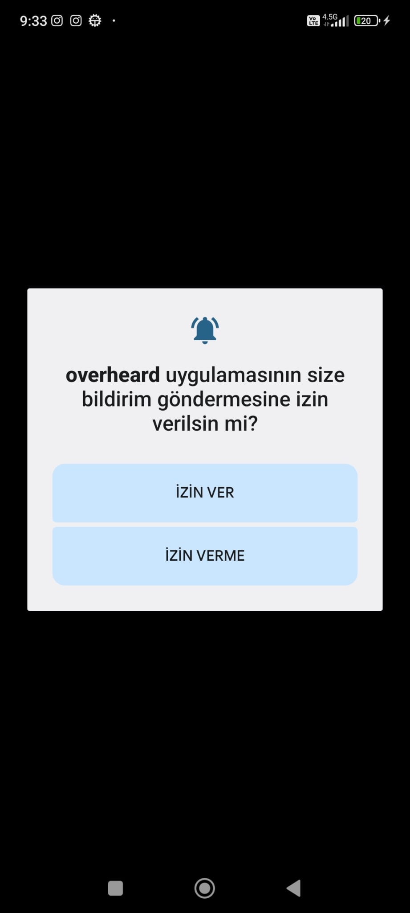</td> <td></td> <td>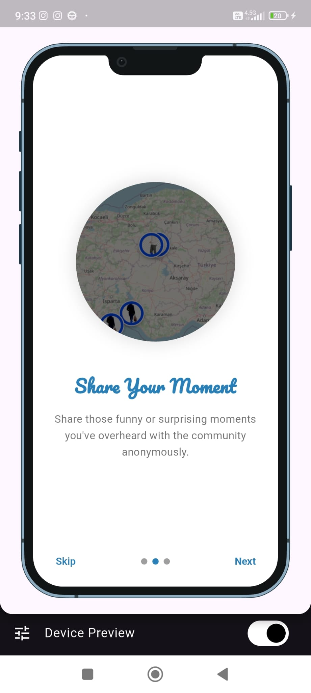</td>  <td>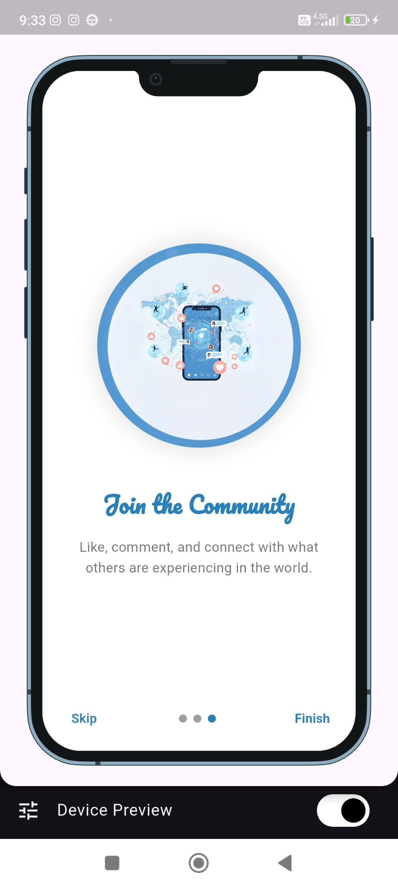</td></tr> <tr> <td>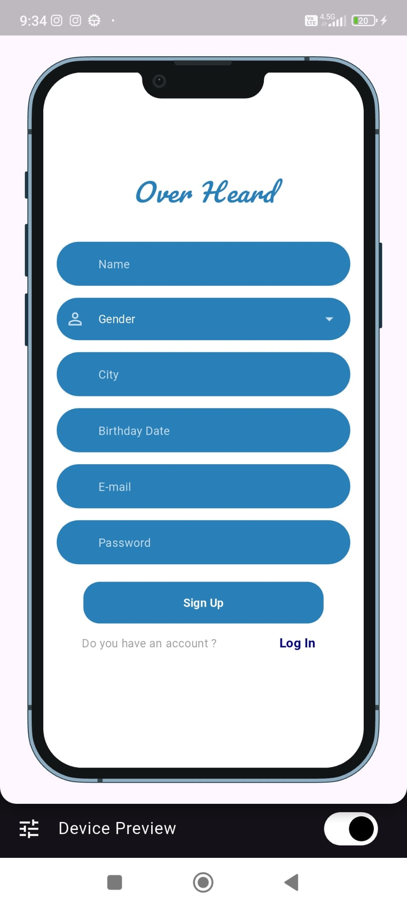</td> <td>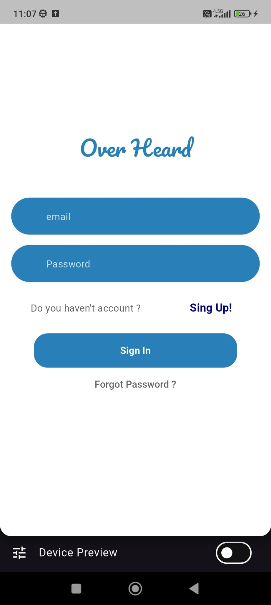</td> <td></td> <td>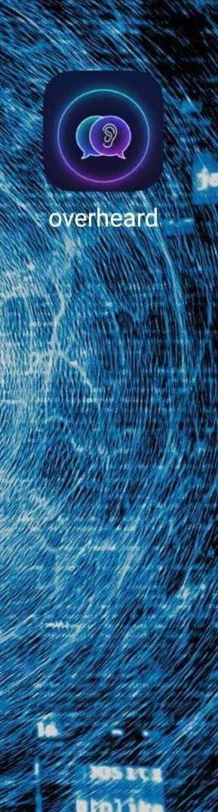</tr> <tr> </td> <td>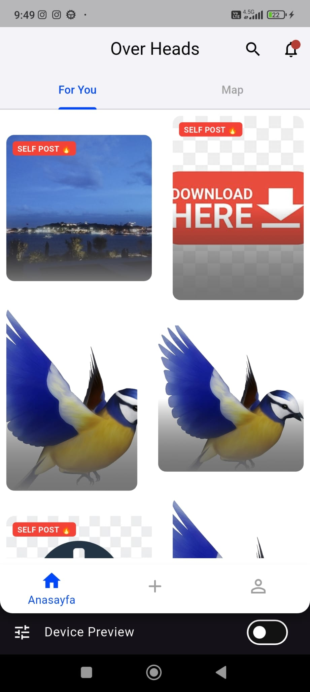</td> <td>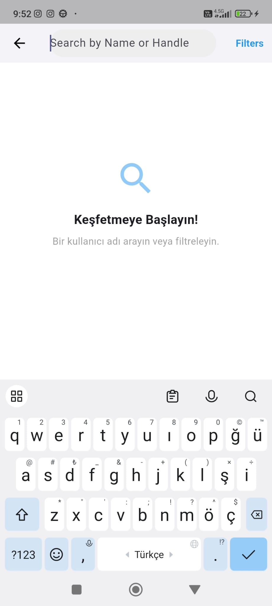</td> <td></td> <td></td> </tr> <tr> <td>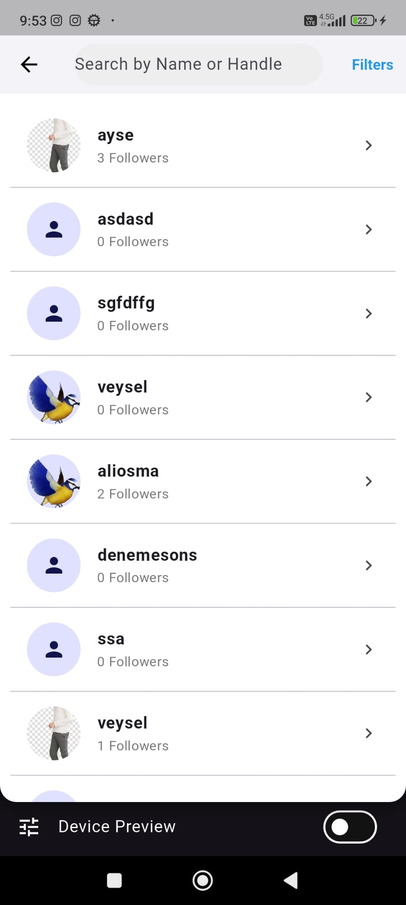</td> <td></td> <td>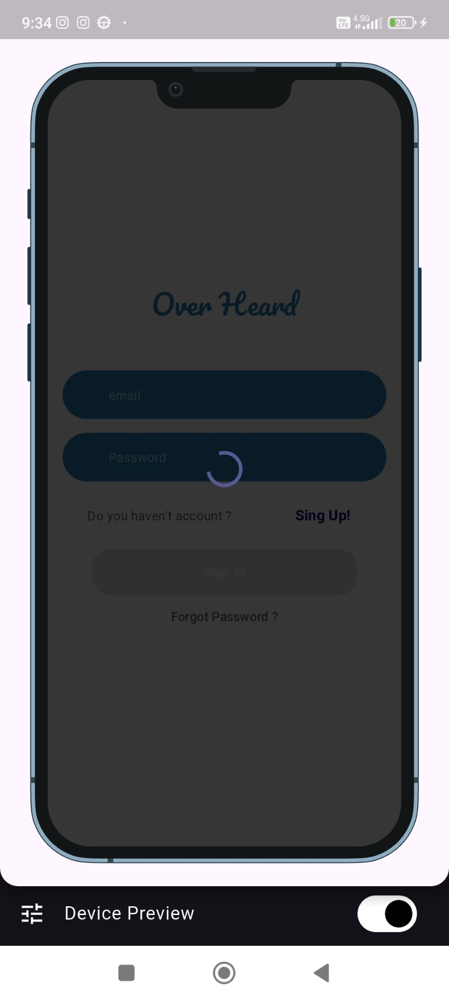</td> <td>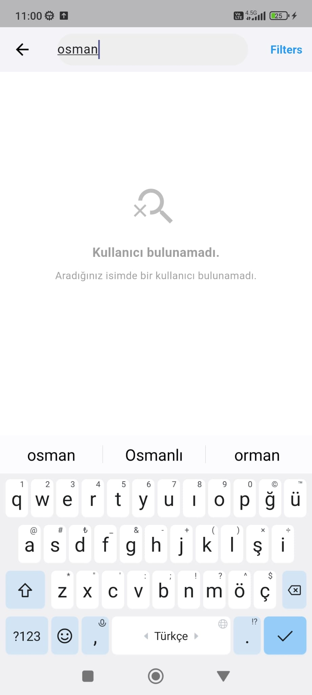</td>  </tr> <tr><td></td> <td>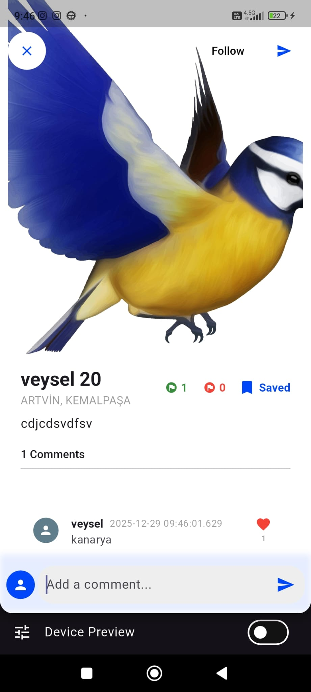</td> </tr> <tr> <td>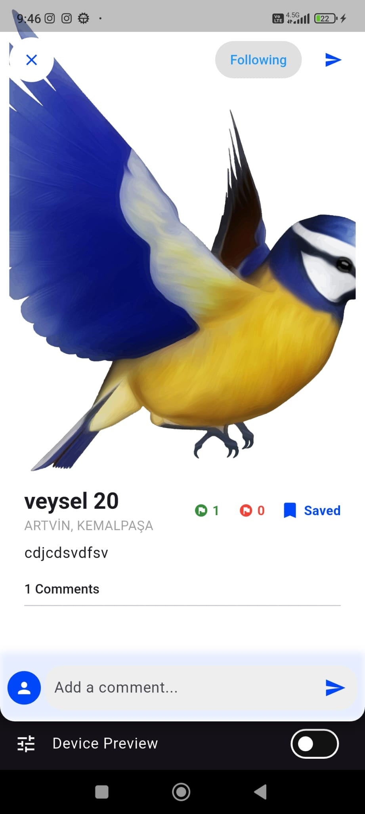</td> <td></td> <td></td> </tr> <tr> <td></td> <td></td> <td></td> </tr> <tr> <td></td> <td></td> <td></td> </tr> <tr> <td></td> <td></td> <td>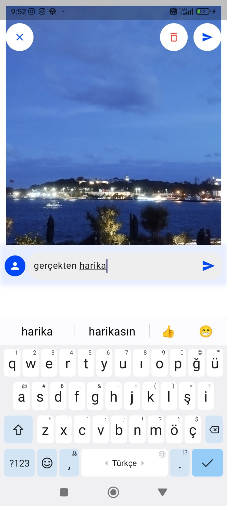</td> </tr> <tr> <td></td> <td>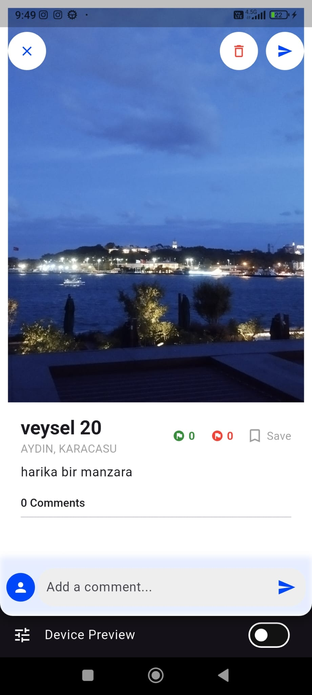</td> <td></td> </tr> <tr> <td></td> <td>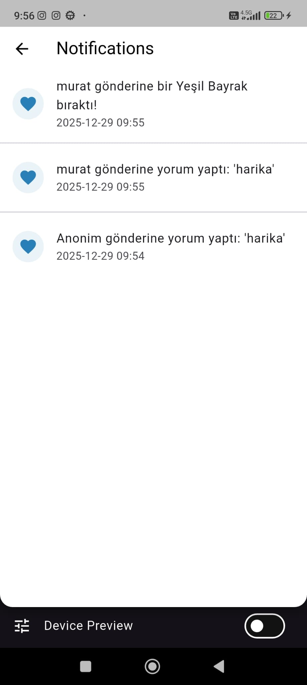</td> <td></td> </tr> <tr> <td></td> <td></td> <td>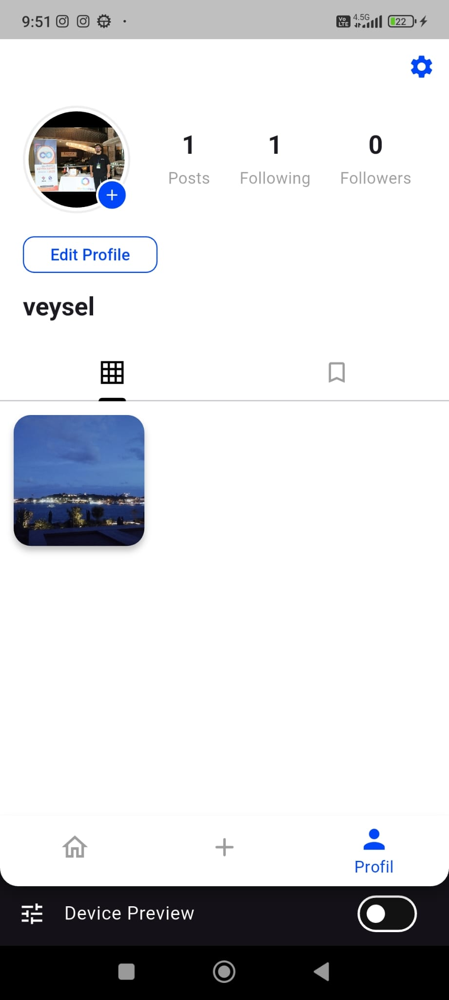</td> </tr> <tr> <td>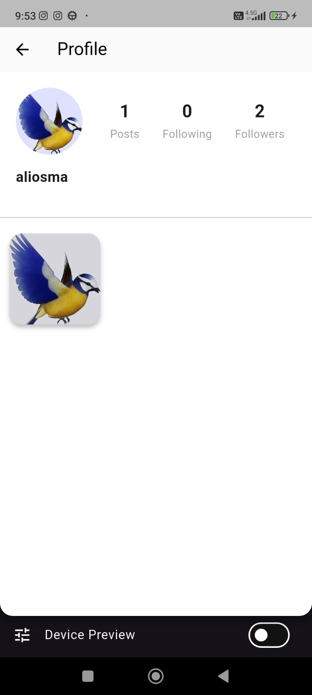</td><td></td><td></td><td>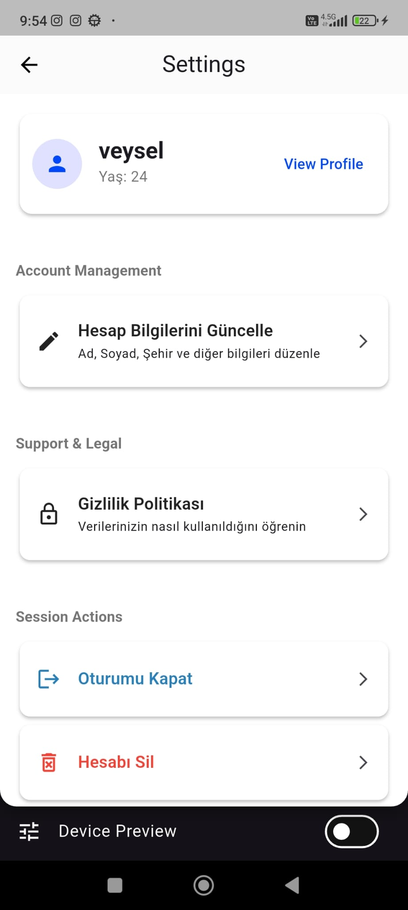</td> <tr> </tr> <td>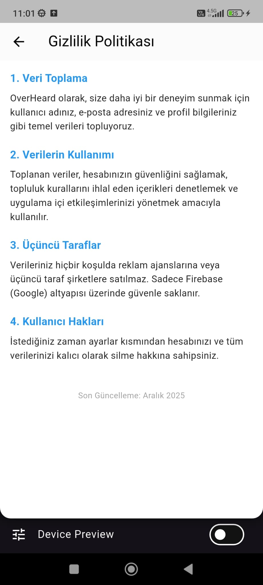</td> <td>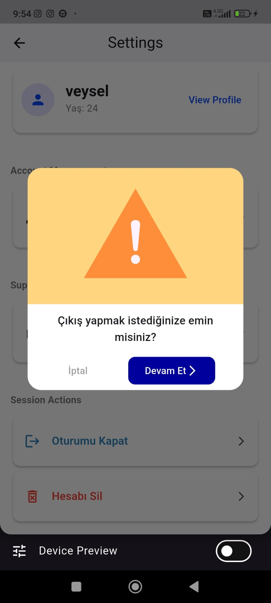</td><td></td></tr> </table>

## 📬 Contact

Made with ❤ by [Veysel UĞURLU](https://github.com/Veyselugurlu)

Feel free to open an issue or reach out if you have feedback or questions!
